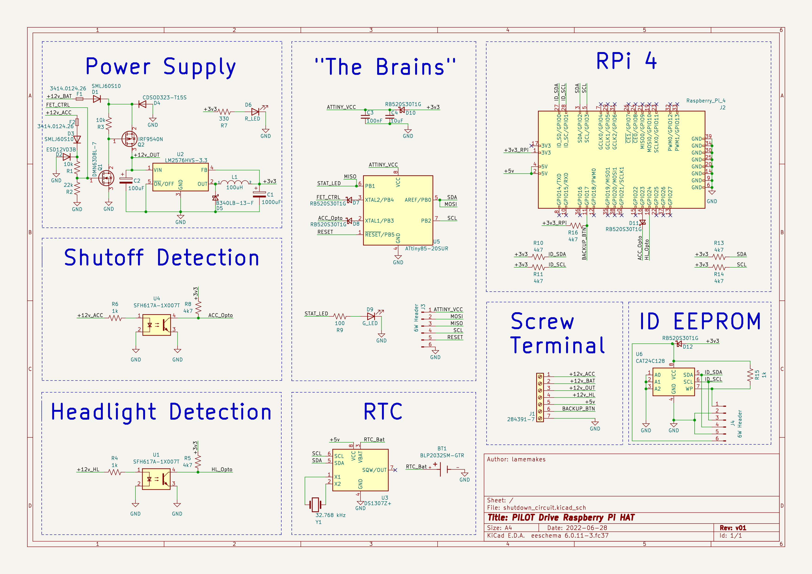

# The hardware of PILOT Drive

This repo contains all of the hardware for PILOT Drive - mainly KiCad schematic + PCB files, and the code used for the ATtiny85 functionality.


## The PILOT Drive HAT MKII

(**TLDR**) The features of the HAT are:
- Optocouplers to isolate & read the ACC +12v & Headlight 12v+ lines
- Via I2C the Raspberry Pi communicates with the ATtiny85 to set the shutdown time
- When there is no ACC +12v detected from the Pi or the ATtiny, the Pi begins a safe shutdown and the ATtiny begins a countdown (Longer than it would take the Pi to shutdown) to kill the power to the BAT +12v. 
- The headlight detection optocoupler is connected to the RPi's GPIO pins
- An I2C connected RTC is included to allow the Pi to keep time without network connectivity.
- Input for general purpose external buttons
- (Mostly) Conforms to the standards of the [Raspberry Pi HAT specifications](https://github.com/raspberrypi/hats), as it includes an ID EEPROM and follows most design specs, but more needs to be implemented

### HAT MKI _[& lessons learned]_

The original MKI HAT came & went. I would call it about 50% functional - as it kept time well and provided for a clean way to route power to the Pi, along with interface with buttons. It didn't work for it's original purpose though. This was due to a few reasons:
- Using tantalum caps instead of electrolytic for the power supply
- Needed decoupling caps!
- Switching the entire ground via an N-FET. Speaks for itself.
- Needed TVS diodes!
 
_Fab'd MKI PCBs_


# HAT MKII

This HAT has yet to be fab'd or even be arranged into a PCB file (but has been fully breadboard tested!). This will certainly be coming at the latest of March, as it needs to be ready for the Syracuse Maker Faire! KiCad files can be found in the "hardware" directory.

_The Schematic of the HAT MKII_


## ATtiny85 Code

### C (current) version

Found in the "firmware" folder, the current C code is based on the ATtiny85 & it's Universal Serial Interface (USI). Using I2C, the Pi can communicate the the ATtiny (default slave address is 0x20) to send a **one byte** integer (<= 255). This single integer represents the time to wait before the ATtiny pulls the power on the entire circuit after it detects the vehicle power off.

As _always_ the firmware is a WIP, and the C version isn't fully functional. I can't quite clamp why, but at the time of writing the second ACK from the ATtiny (after the one byte int) always fails. Addressing works & ACKS, the ATtiny recieves the timeout number and functions with it, but the master sees it as a failed transmission. I feel like I'm close to a fix, but stuck now.

### Arduino (legacy) version

The original firmware was written in Arduino with TinyWireS, but I believed getting a little more "bare metal" would've allowed for a lot more (needed) C & embedded learning, and allowing for quick speeds. That code can be found under "legacy" in the "firmware" folder for use until the C version is completed & smoothed over.

### To flash to the ATtiny85

This firmware requires the [avrdude](https://github.com/avrdudes/avrdude) toolchain to flash the ATtiny. With avrdude installed and an ICSP programmer connected to your ATtiny & computer, the only step left is to configure the following Makefile variables:
- ```PORT```: The serial port the ICSP device is connected to, defaults to ```/dev/ttyUSB0```
- ```AVRDUDE_CONF```: The path to your avrdude config, defauls to ```/etc/avrdude/avrdude.conf```
- ```CLK_SPEED```: Only configure if using an ATtiny85 clock speed other than 8 MHz.

### To send a timeout from to the ATtiny

This will be integrated in the [PILOT Drive software](https://github.com/lamemakes/PILOT-Drive), but an extremely simple Python script can be made to send the required timeout to a specified address, as can be seen in the example below (tested on an RPi 4):

```
import smbus

addr = 0x20 # Send to address 0x20
time = 15   # A timeout of 15 seconds

bus = smbus.SMBus(1)

bus.write_byte(addr, time)
```

At the time of writing, this script will seemingly fail, as it can't recieve a proper ACK from the ATtiny. Regardless, the ATtiny will recieve the time and respond accordingly.


## NOTES:
- The PILOT Drive HAT is a **MAJOR** WIP! More will come soon.
- If building the HAT, "ID EEPROM" is recommended by Raspberry Pi [Hat Standards](https://github.com/raspberrypi/hats/blob/master/designguide.md) but aren't required to make the circuit function.
- The schematic's +5v screw terminal in refers to an external 12v to 5v buck converter. 
- KiCad library files are coming, along with 3D files for the components. 
